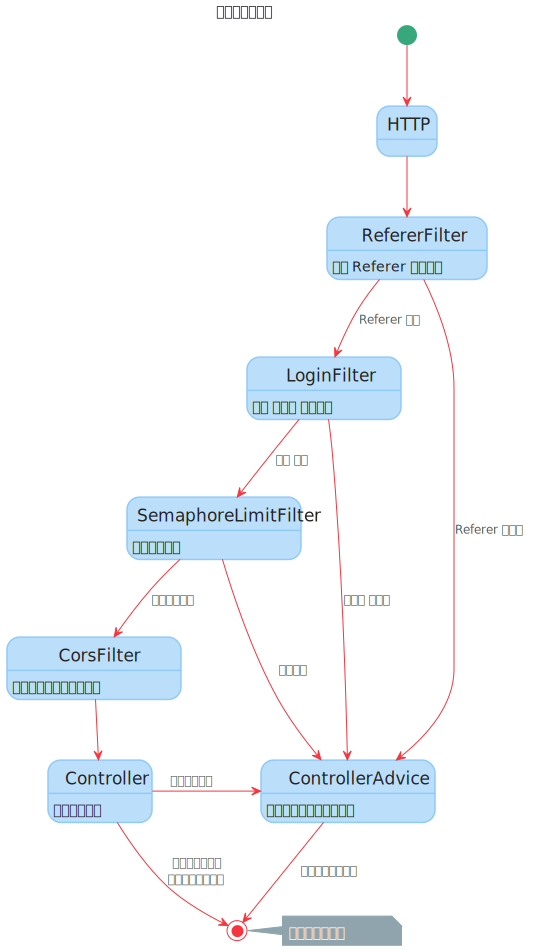
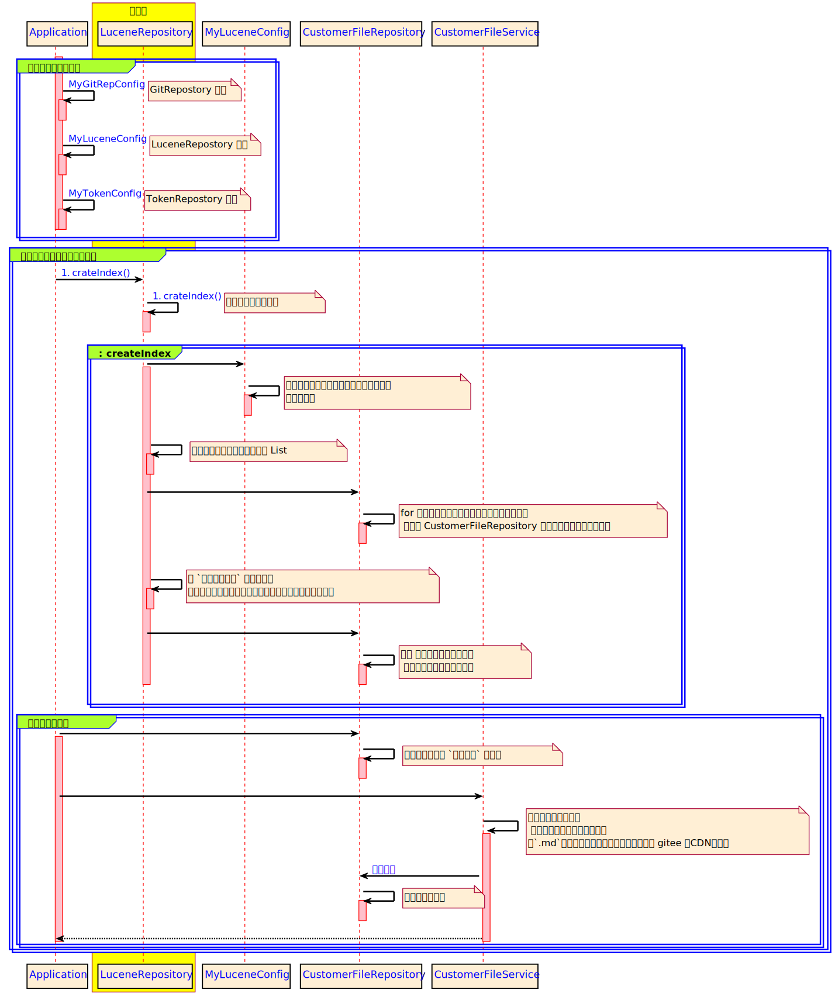
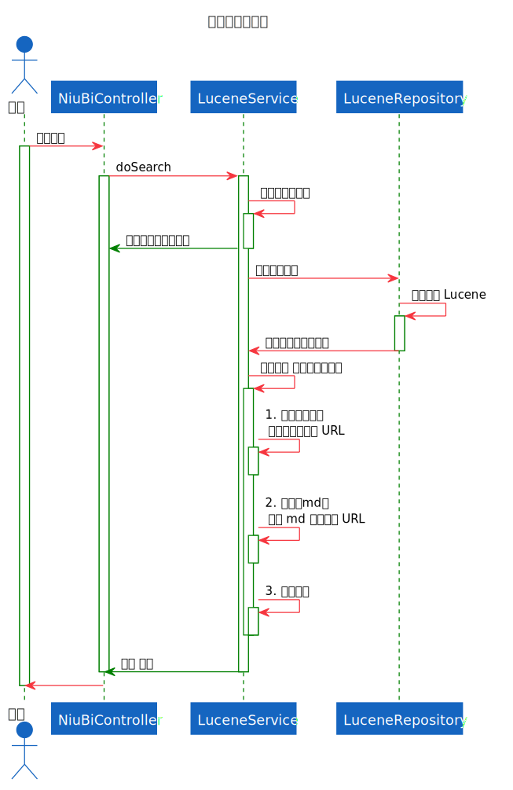

# darian-lucene-file

- https://gitee.com/Darian1996/darian-lucene-file
- https://github.com/Darian1996/darian-lucene-file

# desc

本项目主要是实现了使用 GitHub / Gitee 作为版本库，Lucene 作为搜索引擎。<br>1.  然后进行生成索引，最后进行检索 <br>2.  可以自动更新版本库 <br>3.  实现了 gitHub 网站 md 文件的渲染格式 <br>4.  图片使用 Gitee 的 CDN 加速 <br>5.  支持 PWA 离线访问技术

## TOC

[TOC]


```bash
- -Dlogging.level.com.darian=debug

- java -DFILE_PATH=/software/docs/ -jar darian-lucene-file-0.0.1-SNAPSHOT.jar & 

```


## 架构图

### 程序调用整体状态图



### 启动加载时序图



### 全文检索时序图




## 功能

- 本项目主要是实现了使用 GitHub / Gitee 作为版本库，Lucene 作为搜索引擎。
  1.  然后进行生成索引，最后进行检索 
  2.  可以自动更新版本库 
  3.  实现了 gitHub 网站 md 文件的渲染格式 
  4.  图片使用 Gitee 的 CDN 加速
  5.  使用 PWA 离线访问技术


## 更新
- 2020-11-25
  - 增加了直接跳转 webIde 的界面编辑
  - PWA 已经去掉，如果要开启，请看 html 中注释掉的 `<script src="/js/sw-registration.js">` 打开就好了。
  - fixed "-"字符在查询的时候报错的问题
  - fixed 每个行之间插入空格，用来区分语义，防止两个单词合并为一个单词，来影响匹配
- 2020-11-24
  - 新增添加黑名单IP校验，
- 2020-07-31
  - 增加 `CompareCommitIdScheduler` 类，进行定时的拉取最新的代码，进行比较文档的最新的 commitId ，还有 本工程的最新的 commitId
  - 进行判断，如果有新代码的上传，那就进行重启。（就可以取消 cron 的定时重启了）
  - `ShellUtils.runString()` 调整为 debug 级别
  - 增加 系统启动成功总耗时 日志打印
  - windows 系统不运行 sh 命令，直接阻断，防止日志控制台各种报错
  - 日志由 logback -> log4j2
- 2020-07-29
  - `port.html` 添加删除 IP 的 text
  - `index.html` 更改域名， nacos.web 的域名更改为 `post.darian.top`
  - `.java` ， `.sh` ， `.bat` ，把文件增加 md 的代码行，进行包裹。避免 `# ` 特殊字符影响展示
  - 增加常量 `GBK` ，`UTF-8`，
- 2020-06-30
  - 在进行进行，换行的拼接时，如果首字符 `语义上前后隔离的字符`，那么就添加一个空格，进行隔离
- 2020-06-10
  - 【选用】可以在 port.html 查看 IP 白名单，一键开启一些端口对本机 IP 的访问
    - 本功能，很多人不需要。
    - 直接添加本 IP 到服务器，假如说，服务器上有 zookeeper、redis 等 应用，就可以一键进行白名单的添加
      - （主要本人在公司，在家里的 公网 IP 经常变），所以进行了一键添加白名单。
- 2020-06-07
  - 包装 Jackson 转换的 JSONUtils
  - WebFilter 中错误中断 response 修饰方法的，添加工具类
- 2020-06-03
  - 增加了未完成的文档的在目录的提示，
    - 文章内容中有 `[未完成]` 的字符的，标记为未完成，在文档中，显示为红色
    - 文件夹名字有 `[未完成]` 的字符的，标记为未完成，在文档中，显示为红色
    - 缓存增加，函数式接口 Utils，代码实现更加简洁
- 2020-05-31
  - 目录生成截取不拼接域名，可以实现，多环境（多个域名）下部署的问题，多个域名解析下的问题
  - 修复目录的集合为静态变量，修复下次进来缓存失效后，集合为重复添加的问题，调用以前，初始化一个新的 ArrayList
  - contentDetail 页面里边的图片填充充满整个页面的宽度
  - index 里的图片最大充满单元格
- 2020-05-30
  - 升级为 Service Worker ，可以支持看过一遍以后，离线访问
  - token 的验证，优先级更改为 如下，ServiceWorker ，Fetch 内部增加了携带 Cookie
    1. `cookie.get("token")`
    2. `httpHeader.get('token')`
  - fix 入参未校验的问题
  - 依赖管理为 `dependencyManagement` 
- 2020-05-27
  - ztree 是否开启，各个级别的标题自动添加序号, false 去掉， true 添加。 `is_auto_number: false,`
- 2020-05-25
  - 图片 `.md` 文件中的图片，都添加链接，连接到 gitee 的 CDN
- 2020-05-22
  - 添加，系统启动通知，每一次系统重启，都会进行通知，
  - 添加系统启动时间，在页面中显示出来
  - filter 中的提示信息增加 spring-boot 标志
  - 添加，自动生成目录，目录在内存中生成，不修改文件
  - 时序图更新
- 2020-05-15
  - 去掉 `.md` 文件中的 图片  (2020-05-15，修改) , 正则匹配，原匹配不正确，修改 15，修改
    - `string = string.replaceAll("\\!\\[.*\\]\\(.+\\)", "");`  ->  
      - `string = string.replaceAll("\\\\!\\[.*\\\\]\\(.+\\)", "");`
  - 文件名名转化为唯一标识的时候，空格转化为下划线 ： `_`
- 2020-05-10
  - 去掉空格的话, 多个英文字母会重叠在一起，影响匹配，所以该分隔开的还是分隔开，提高分词准确率，多个空格和换行，替换为单个空格
- 2020-04-29
  - 添加 google 的 `ConcurrentLinkedHashMap`, 加快查询的速度。
  - <a href="https://github.com/ben-manes/concurrentlinkedhashmap" target="_blank"> ConcurrentLinkedHashMap-GitHub-链接<a>

- 2020-04-25
  - 博客文件名字存储时进行特殊字符的过滤，bug_fix 特殊文件在查询文章详情时报错

- 2020-04-21
  - 进行 `CustomerFileRepository` 的改造，其内部对象设置为不可变的对象，添加获取所有 key 的接口
  - 代码进行改造，大部分代码进行领域的细致划分。不再进行一坨的写法。细致的进行模型的构建，进行简单的划分。
  - 应用启动时进行预加载的检查。可以开启，或者不开启

- 2020-04-15
  - 进行登陆验证，嵌套进入 `github.page` 页面
  - 跨域时，需要进行，传递的设置。
    - `headers.put("Access-Control-Allow-Headers", Arrays.asList("x-requested-with", "token"));`
            

- 2020-04-12
  - 进行生命周期上下文的加载，前后关系的映射(两个初始化 config 文件的修改)
  - 全面外部化配置
  - 查询后再计算 `gitHubUrl` 和 `giteeUrl` 改为，先计算存到 Lucene 中，加快速度的查询
  - `@ControllerAdvice` 添加 `@RestController` 注解，修复报错未知服务器错误
  

## 注意：
- lucene 的 7.1.0 版本，权重在查询时候添加，减少索引的不断生成
  - 权值默认1, 该值越大排名越前
  - 权重查询 看  `org.apache.lucene.search.BoostQuery`
- `IndexWriterConfig `
  - `IndexWriterConfig` 7.1.0 不需要填写 version
- IK分词器地址： `https://github.com/magese/ik-analyzer-solr`
- Field
  - `TextField` 创建索引
  - `StringField` 不创建索引，全文匹配
  - `StoredField` 只存储

## 文件读取

- `.md` 文件采用 UTF-8 读取
- `.bat` 文件采用 GBK 读取
  - `.bat` 存储采用 ASCII ，不然在 windows cmd 窗口会乱码

  
## URL 关系


### 一些 css, JS 对应源地址
```html
<!-- 开源的 github-markdown 的地址 -->
<!-- https://github.com/sindresorhus/github-markdown-css -->
<link rel="stylesheet" href="/css/github-markdown.css">
<!--    <link rel="stylesheet" href="https://sindresorhus.com/github-markdown-css/github-markdown.css">-->
<!-- toc 边框 -->
<link rel="stylesheet" href="/css/zTreeStyle.css">
<!--    <link rel="stylesheet" href="https://i5ting.github.io/i5ting_ztree_toc/build/style/zTreeStyle/zTreeStyle.css">-->
<!---->
<script src="/js/jquery-3.3.1.min.js"></script>
<!--    <script src="https://code.jquery.com/jquery-3.3.1.min.js"></script>-->

<script src="/js/marked.min.js"></script>
<!--    <script src="https://cdn.bootcss.com/marked/0.3.4/marked.min.js"></script>-->

<script src="/js/highlight.min.js"></script>
<!--    <script src="https://cdn.bootcss.com/highlight.js/8.0/highlight.min.js"></script>-->
<!-- toc 边框 -->
<script src="/js/jquery.ztree_toc.min.js"></script>
<!--    <script src="https://i5ting.github.io/i5ting_ztree_toc/build/js/jquery.ztree_toc.min.js"></script>-->
<script src="/js/jquery.ztree.all-3.5.min.js"></script>
<!--    <script src="https://i5ting.github.io/i5ting_ztree_toc/build/js/jquery.ztree.all-3.5.min.js"></script>-->
<script src="/js/darian.own.js"></script>
<!-- 添加 PWA, Service Worker 注册 -->
<script src="/js/sw-registration.js"></script>
```

#### 参考资料

```bash

Lucene介绍与入门使用 https://www.cnblogs.com/xiaobai1226/p/7652093.html

```